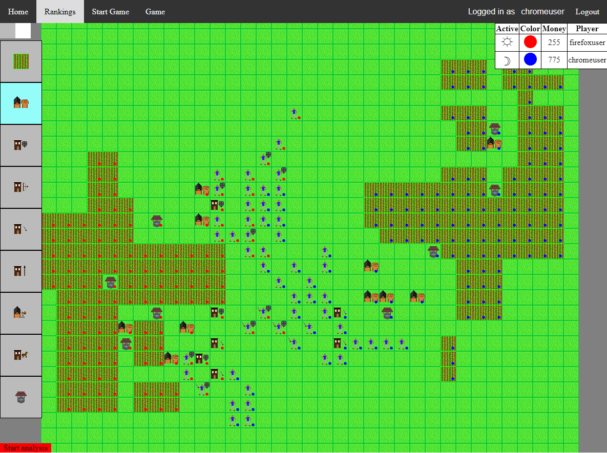

This repository contains an archive of a number of rewrites of a turn-based strategy board game turned into a video game in C++/Win32, C++ direct2d, C++ QT, and then finally javascript/HTML. No version is finished. I learned a lot from these many versions and rewrites of this game, but never actually found the game fun enough to get excited about finishing implementing it. Rather, it was the development itself, and the puzzles involved, that were fun.

## Current game information

The game client is currently deployed on a static web server [here](http://script-wars-deploy.s3-website-us-west-2.amazonaws.com/). The multiplayer server is not currently deployed anywhere, but you can still start a single player game and play around with the controls.

To give an impression of what it looks like, here is a screenshot of a position in a game I was playing by myself:

